# MapxusMap Android SDK 使用说明

## 1. 产品概述
MapxusMap SDK是一套地图开发调用接口，开发者可以轻松地开发者可以轻松地在自己的Android应用中加入地图相关的功能，包括：室内地图显示、自定义地图样式、与地图交互、地图上绘制、地图定位、兴趣点搜索、路线规划等功能
### 1.1 兼容性
MapxusMap Android SDK支持android4.4及以上系统

注意：

配合使用
**如需使用Mapxus Positioning，MapxusMap 3.0.0及以上版本需与Mapxus Positioning 0.4.0及以上版本兼容使用**

**如需使用Mapxus Positioning，MapxusMap 2.4.1及以上版本需与Mapxus Positioning 0.3.7及以上版本兼容使用**

**如需使用Mapxus Positioning，MapxusMap 2.3.3-beta及以上版本需与Mapxus Positioning 0.3.6及以上版本兼容使用**


### 1.2 获取授权
请向我司申请获取appid 、secret。

## 2. 入门指南
### 2.1 创建工程
首先为您的APP创建一个工程，然后按照以下步骤手动集成。
#### 2.1.1 添加jcenter依赖仓库


```java

allprojects {
    repositories {
        jcenter()
    }
}

```

#### 2.1.2 添加依赖

然后在app的build.gradle中添加依赖dependencies

```java

dependencies { 
 ...

	// MapxusMap
	implementation "com.mapxus.map:mapxusmap:3.0.0"
	
	// Mapbox
	implementation "com.mapbox.mapboxsdk:mapbox-android-sdk:7.2.0"

 ...
}	

```

#### 2.1.3 设置Java 8 support 

请参照Google 使用Java 8 语言相关文档，设置Java 8 Support

[https://developer.android.com/studio/write/java8-support](https://developer.android.com/studio/write/java8-support)

#### 2.1.4 添加混淆规则

请避免混淆Mapxus Map，在Proguard混淆文件中增加以下配置：

```
-keep class com.mapxus.map.** {*;}
-keep class com.mapxus.services.** {*;}
-dontwarn com.mapxus.map.**
-dontwarn com.mapxus.services.**

```


#### 2.1.5 设置Key和Secret
设置key和secret有两种方式:

##### 第一种方式:

1、 在BaseApplication 的onCreate()方法中添加

```java
	MapxusMapContext.init(getApplicationContext());
```

2、然后在AndroidManifest.xml配置如下代码:

``` java
	<meta-data
	        android:name="com.mapxus.api.v1.appid"
	        android:value="获取到的key" />
	<meta-data
	    android:name="com.mapxus.api.v1.secret"
	    android:value="获取到的secret" />
```

##### 第二种方式:

在BaseApplication 的onCreate()方法中添加

``` java
	MapxusMapContext.init(getApplicationContext()，Key，secret);
```
#### 2.2 创建地图
	
##### 2.2.1 Activity应用添加地图

首先在布局xml文件中添加Mapbox地图控件:

```xml
      <com.mapbox.mapboxsdk.maps.MapView
        android:id="@+id/mapView"
        android:layout_width="match_parent"
        android:layout_height="match_parent"
        app:mapbox_cameraTargetLat="22.304716516178253"
        app:mapbox_cameraTargetLng="114.16186609400843"
        app:mapbox_cameraZoom="17" />
```

然后在Activity文件中添加地图代码:

```java

    public class SimpleMapViewActivity extends AppCompatActivity {

    private MapView mapView;
    private MapViewProvider mapViewProvider;

    @Override
    protected void onCreate(Bundle savedInstanceState) {
        super.onCreate(savedInstanceState);
        setContentView(R.layout.activity_basic_simple_mapview);
        mapView = (MapView) findViewById(R.id.mapView);
        mapView.onCreate(savedInstanceState);
        mapViewProvider = new MapboxMapViewProvider(this, mapView);
    }

    // Add the mapView lifecycle to the activity's lifecycle methods
    @Override
    public void onResume() {
        super.onResume();
        mapView.onResume();
    }

    @Override
    protected void onStart() {
        super.onStart();
        mapView.onStart();
    }

    @Override
    protected void onStop() {
        super.onStop();
        mapView.onStop();
    }

    @Override
    public void onPause() {
        super.onPause();
        mapView.onPause();
    }

    @Override
    public void onLowMemory() {
        super.onLowMemory();
        mapView.onLowMemory();
    }

    @Override
    protected void onDestroy() {
        super.onDestroy();
        mapView.onDestroy();
        mapViewProvider.onDestroy();
    }

    @Override
    protected void onSaveInstanceState(Bundle outState) {
        super.onSaveInstanceState(outState);
        mapView.onSaveInstanceState(outState);
    }
	}
```
在项目中使用地图的时候需要注意，需要合理的管理地图生命周期。

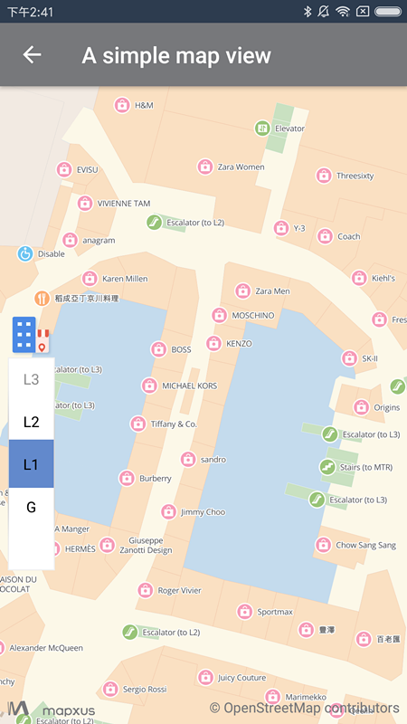

#### 2.2.2 使用Fragment显示地图
向Activity文件添加 SupportMapxusMapFragment：

```java

    SupportMapxusMapFragment mapFragment;
    @Override
    protected void onCreate(Bundle savedInstanceState) {
        super.onCreate(savedInstanceState);
        setContentView(R.layout.activity_basic_support_map_frag);
        if (savedInstanceState == null) {
            // Create fragment
            final FragmentTransaction transaction = getSupportFragmentManager().beginTransaction();
            MapboxMapOptions options = new MapboxMapOptions();
            options.camera(new CameraPosition.Builder()
                    .target(LatLngConstant.ELEMENT_LATLON)
                    .zoom(17)
                    .build());

            MapView mapView = new MapView(SupportMapFragmentActivity.this, options);
            // Create map fragment
            mapFragment = SupportMapxusMapFragment.newInstance(mapView);
            // Add map fragment to parent container
            transaction.add(R.id.container, mapFragment, "com.mapxus.map");
            transaction.commit();
        } else {
            mapFragment = (SupportMapxusMapFragment) getSupportFragmentManager().findFragmentByTag("com.mapxus.map");
        }
    }
```
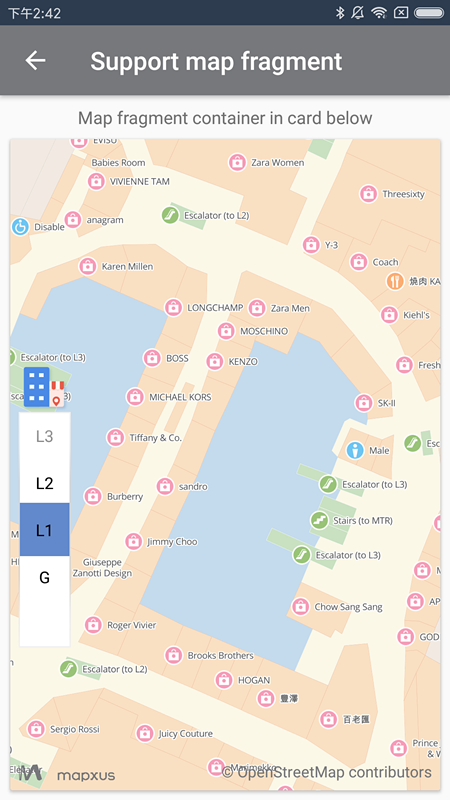
##### 2.2.3 动态创建地图
向Activity文件中添加 MapView：

```java

    private MapViewProvider mapViewProvider;
    private MapView mapboxMapView;

    @Override
    protected void onCreate(Bundle savedInstanceState) {
        super.onCreate(savedInstanceState);

        // create mapbox map
        MapboxMapOptions mapboxMapOptions = new MapboxMapOptions();
        mapboxMapOptions.camera(new CameraPosition.Builder().target(LatLngConstant.ELEMENT_LATLON).zoom(17).build());
        mapboxMapView = new MapView(this, mapboxMapOptions);
        mapboxMapView.onCreate(savedInstanceState);
        mapViewProvider = new MapboxMapViewProvider(this, mapboxMapView);
        setContentView(mapboxMapView);
    }
```
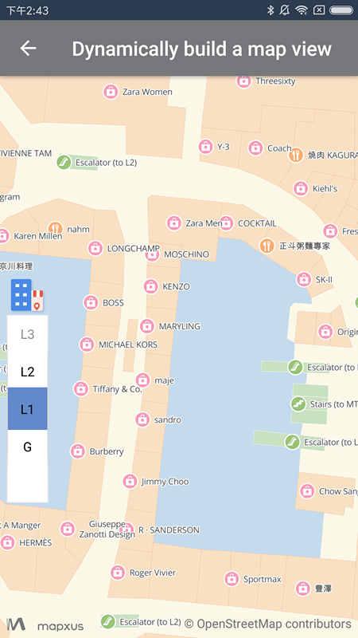

#### 2.2.4 初始化地图指定buildingId和floor

向Activity文件中添加 MapView：

```java

    private MapViewProvider mapViewProvider;
    private MapView mapboxMapView;

    @Override
    protected void onCreate(Bundle savedInstanceState) {
        super.onCreate(savedInstanceState);

        setContentView(R.layout.activity_basic_init_with_building);
        mapboxMapView = (MapView) findViewById(R.id.mapView);
        MapxusMapOptions mapxusMapOptions = new MapxusMapOptions().setBuildingId("elements_hk_dc005f").setFloor("L2");
        mapViewProvider = new MapboxMapViewProvider(this, mapboxMapView, mapxusMapOptions);
    }
```

#### 2.2.5 初始化地图指定POI

向Activity文件中添加 MapView：

```java

    private MapViewProvider mapViewProvider;
    private MapView mapboxMapView;
    private static final String POI_ID = "74233";

    @Override
    protected void onCreate(Bundle savedInstanceState) {
        super.onCreate(savedInstanceState);

        setContentView(R.layout.activity_basic_init_with_building);
        mapboxMapView = (MapView) findViewById(R.id.mapView);
        MapxusMapOptions mapxusMapOptions = new MapxusMapOptions().setPoiId(POI_ID);
        mapViewProvider = new MapboxMapViewProvider(this, mapboxMapView, mapxusMapOptions);
    }
```


## 3.SDK功能

### 3.1 地图控件

控件是指浮在地图图面上的一系列用于操作地图的组件，例如楼层选择等。 MapxusUiSettings 类用于操控这些控件，以定制自己想要的视图效果。MapxusUiSettings类对象的实例化需要通过 MapxusMap类来获取

``` java
     mapViewProvider.getMapxusMapAsync(new OnMapxusMapReadyCallback() {
            @Override
            public void onMapxusMapReady(MapxusMap mapxusMap) {
            	MapxusUiSettings mapxusUiSettings = mapxusMap.getMapxusUiSettings();
            }
    }
```

#### 3.1.1 选择器

选择器是提供给 App 端用户控制是否显示楼层切换列表和建筑切换器的按钮，此控件默认打开（显示），可以通过以下方法控制其隐藏：

```java
mapxusUiSettings.setSelectorEnabled(false);
```

####3.1.2 建筑选择器

建筑选择器是用于用户切换可视地图内的建筑，默认打开（显示）。通过如下接口控制其隐藏：

```java
mapxusUiSettings.setBuildingSelectorEnabled(false);
```


### 3.2 地图事件
#### 3.2.1 建筑切换监听
监听建筑的切换：

```java
mapxusMap.addOnBuildingChangeListener(new MapxusMap.OnBuildingChangeListener() {
            @Override
            public void onBuildingChange(IndoorBuilding indoorBuildingInfo) {
                
            }
        });
```
#### 3.2.2 楼层切换监听
监听楼层间切换：

```java

mapxusMap.addOnFloorChangeListener(new MapxusMap.OnFloorChangeListener() {
            @Override
            public void onFloorChange(IndoorBuilding indoorBuilding, String floor) {
                
            }
        });
    }
```

#### 3.2.3 室内POI点击监听

点击地图可监听POI位置变更：

```java
     @Override
    public void onMapxusMapReady(MapxusMap mapxusMap) {

        mapxusMap.addOnIndoorPoiClickListener(new MapxusMap.OnIndoorPoiClickListener() {
            @Override
            public void onIndoorPoiClick(Poi poi) {

                String message = String.format(getString(R.string.click_poi_message), poi.getName());

                poiClickTv.setText(message);
            }
        });
    }
```

### 3.3 在地图上绘制

#### 3.3.1 绘制Marker
Marker用来在地图上标记任何位置，例如用户位置、车辆位置、店铺位置等一切带有位置属性的事物。
创建marker的时候，可以指定buildingId和floor，使marker只在指定floor可见。
创建一个Marker：

```java 
     mapViewProvider.getMapxusMapAsync(new OnMapxusMapReadyCallback() {
            @Override
            public void onMapxusMapReady(MapxusMap mapxusMap) {

                MapxusMarkerOptions mapxusMarkerOptions = new MapxusMarkerOptions();
                mapxusMarkerOptions.setPosition(new LatLng(LatLngConstant.ELEMENT_LATLON.getLatitude(), LatLngConstant.ELEMENT_LATLON.getLongitude()));
                mapxusMarkerOptions.setFloor("3");
                mapxusMarkerOptions.setBuildingId("elements_hk_dc005f");


                MapxusMarkerOptions mapxusMarkerOptions2 = new MapxusMarkerOptions();
                mapxusMarkerOptions2.setPosition(new LatLng(22.304616516178253, 114.16176609400843)).setFloor("2");
                mapxusMarkerOptions2.setBuildingId("elements_hk_dc005f");


                MapxusMarkerOptions mapxusMarkerOptions3 = new MapxusMarkerOptions();
                mapxusMarkerOptions3.setPosition(new LatLng(22.304516516178253, 114.16186609400843));

                mapxusMap.addMarker(mapxusMarkerOptions);
                mapxusMap.addMarker(mapxusMarkerOptions2);
                mapxusMap.addMarker(mapxusMarkerOptions3);
            }
        });
```
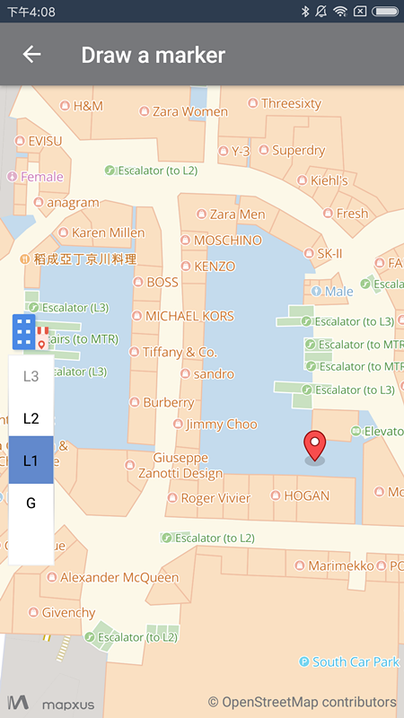

#### 3.3.2 绘制自定义Marker

可根据实际的业务需求，在地图指定的位置上添加自定义的Marker。

创建一个带有自定义图标的Marker：

```java
      mapViewProvider.getMapxusMapAsync(new OnMapxusMapReadyCallback() {
            @Override
            public void onMapxusMapReady(MapxusMap mapxusMap) {
                mapxusMap.addMarker(new MapxusMarkerOptions()
                        .setBuildingId("elements_hk_dc005f")
                        .setFloor("3")
                        .setPosition(new LatLng(LatLngConstant.ELEMENT_LATLON.getLatitude(),LatLngConstant.ELEMENT_LATLON.getLongitude()))
                        .setTitle(getString(R.string.draw_custom_marker_options_title))
                        .setSnippet(getString(R.string.draw_custom_marker_options_snippet))
                        .setIcon(R.drawable.purple_marker));
            }
        });
```
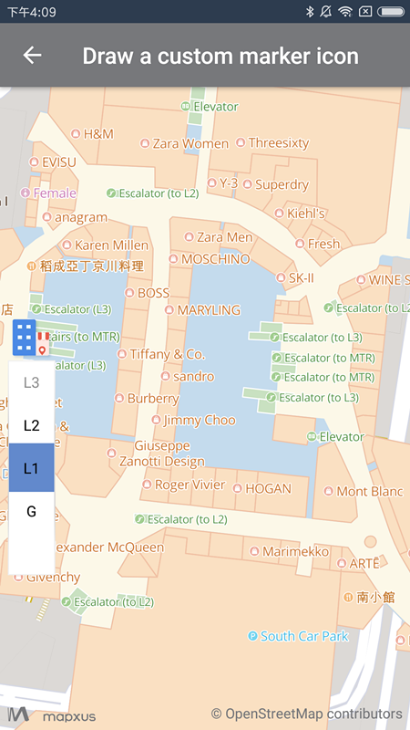

### 3.5 建筑搜索

根据搜索是通过BuildingSearch类提供功能，实用如下方式初始化：

**初始化 BuildingSearch对象**

```java
        buildingSearch = BuildingSearch.newInstance();
```
**设置搜索回调监听**

```java
        buildingSearch.setBuildingSearchResultListener(this);
```

#### 3.5.1 搜索附近建筑

##### 3.5.1.1 设置搜索参数

```java
        NearbySearchOption nearbySearchOption = new NearbySearchOption();
        nearbySearchOption.mRadius = 2;
        nearbySearchOption.location(new LatLng(LatLngConstant.ELEMENT_LATLON.getLatitude(), LatLngConstant.ELEMENT_LATLON.getLongitude()));
        nearbySearchOption.keyword(keyWord);
        
    }
```

##### 3.5.1.2 执行搜索

```java
buildingSearch.searchNearby(nearbySearchOption);
```
##### 3.5.1.3 搜索结果处理

```java
     @Override
    public void onGetBuildingResult(BuildingResult buildingResult) {

        if (buildingResult.status != 0) {
            Toast.makeText(this, buildingResult.error.toString(), Toast.LENGTH_LONG).show();
            return;
        }
        if (buildingResult.getIndoorBuildingList() == null || buildingResult.getIndoorBuildingList().isEmpty()) {
            Toast.makeText(this, getString(R.string.no_result), Toast.LENGTH_LONG).show();
            return;
        }

        mapboxMap.clear();
        indoorBuildingOverlay = new MyIndoorBuildingOverlay(mapboxMap, buildingResult.getIndoorBuildingList());
        indoorBuildingOverlay.addToMap();
        indoorBuildingOverlay.zoomToSpan();

    }

    @Override
    public void onGetBuildingDetailResult(BuildingDetailResult buildingDetailResult) {

    }
```
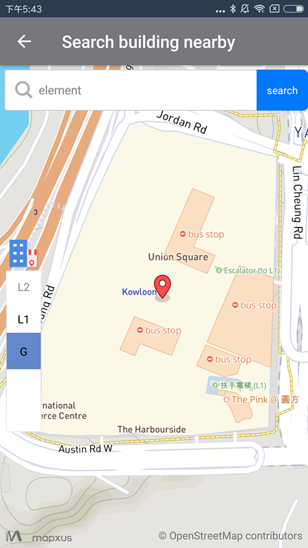

#### 3.5.2 指定范围内搜索

##### 3.5.2.1 设置查询范围参数

```java       
        private LatLngBounds latLngBounds;
        com.mapxus.map.model.LatLng southweast = new com.mapxus.map.model.LatLng(22.2918962, 114.1353782);
        com.mapxus.map.model.LatLng northeast = new com.mapxus.map.model.LatLng(22.3418344, 114.2089048);
        latLngBounds = new LatLngBounds(southweast, northeast);
        BoundSearchOption boundSearchOption = new BoundSearchOption();

        boundSearchOption.bound(latLngBounds);
        boundSearchOption.keyword(keyWord);

```

##### 3.5.2.2 执行搜索

```java
        
        buildingSearch.searchInBound(boundSearchOption);
        
```

##### 3.5.2.3 搜索结果处理

```java
 @Override
    public void onGetBuildingResult(BuildingResult buildingResult) {

        if (buildingResult.status != 0) {
            Toast.makeText(this, buildingResult.error.toString(), Toast.LENGTH_LONG).show();
            return;
        }
        if (buildingResult.getIndoorBuildingList() == null || buildingResult.getIndoorBuildingList().isEmpty()) {
            Toast.makeText(this, getString(R.string.no_result), Toast.LENGTH_LONG).show();
            return;
        }

        if (indoorBuildingOverlay != null) {
            indoorBuildingOverlay.removeFromMap();
            indoorBuildingOverlay = null;
        }
        indoorBuildingOverlay = new MyIndoorBuildingOverlay(mapboxMap, buildingResult.getIndoorBuildingList());
        indoorBuildingOverlay.addToMap();
        indoorBuildingOverlay.zoomToSpan();
    }

```

       

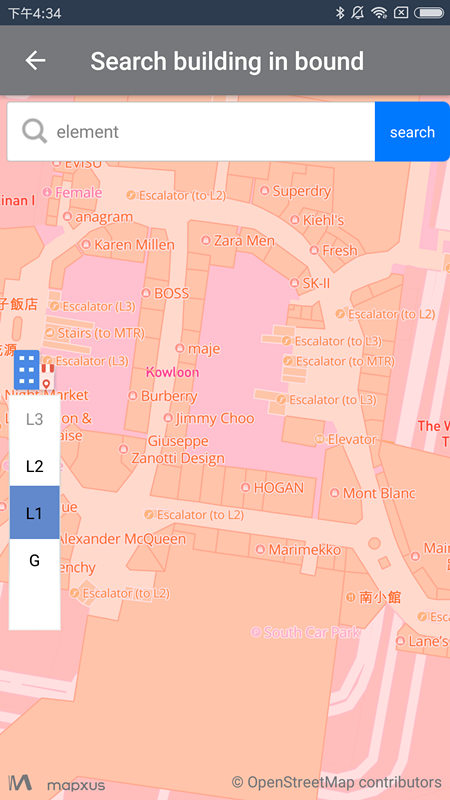

#### 3.5.3 根据建筑ID搜索建筑物信息

##### 3.5.3.1 设置查询参数

```java
	DetailSearchOption detailSearchOption = new DetailSearchOption();
	detailSearchOption.id(keyWord);

```
##### 3.5.3.2 执行搜索

```java
	buildingSearch.searchBuildingDetail(detailSearchOption);
```
##### 3.5.3.3 搜索结果处理

```java
	@Override
    public void onGetBuildingDetailResult(BuildingDetailResult buildingDetailResult) {
        if (buildingDetailResult.status != 0) {
            Toast.makeText(this, buildingDetailResult.error.toString(), Toast.LENGTH_LONG).show();
            return;
        }
        if (buildingDetailResult.getIndoorBuildingInfo() == null) {
            Toast.makeText(this, getString(R.string.no_result), Toast.LENGTH_LONG).show();
            return;
        }

        mapboxMap.clear();
        IndoorBuildingInfo indoorBuildingInfo = buildingDetailResult.getIndoorBuildingInfo();

        Marker marker = mapboxMap.addMarker(new ObjectMarkerOptions()
                .position(
                        new LatLng(indoorBuildingInfo.getLabelCenter()
                                .getLat(), indoorBuildingInfo
                                .getLabelCenter().getLon()))
                .title(indoorBuildingInfo.getName().get("default")).snippet(indoorBuildingInfo.getAddress().get("default").toShortAddress())
                .object(indoorBuildingInfo));
        mapboxMap.moveCamera(CameraUpdateFactory.newLatLngZoom(marker.getPosition(), 16));
    }

```


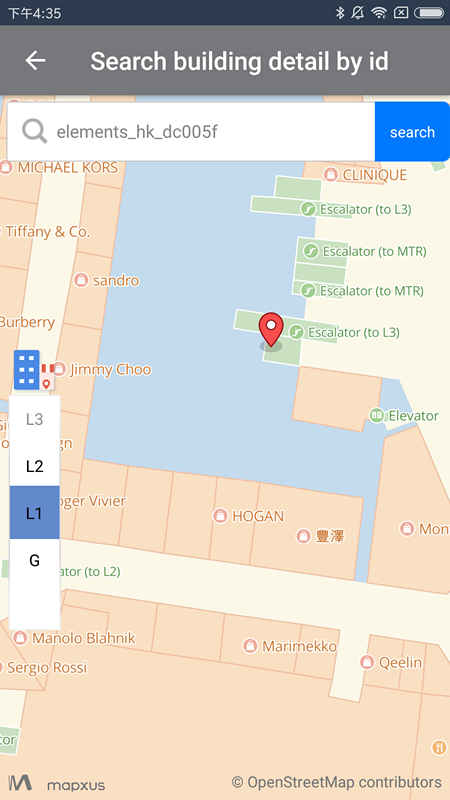

####3.5.4搜索全球建筑

##### 3.5.4.1 设置查询参数

```java

	GlobalSearchOption globalSearchOption = new GlobalSearchOption();
	globalSearchOption.keyword(keyWord);
```
##### 3.5.4.2 执行搜索

```java

	buildingSearch.searchInGlobal(globalSearchOption);
```
##### 3.5.4.3 搜索结果处理

```java
@Override
    public void onGetBuildingResult(BuildingResult buildingResult) {

        if (buildingResult.status != 0) {
            Toast.makeText(this, buildingResult.error.toString(), Toast.LENGTH_LONG).show();
            return;
        }
        if (buildingResult.getIndoorBuildingList() == null || buildingResult.getIndoorBuildingList().isEmpty()) {
            Toast.makeText(this, getString(R.string.no_result), Toast.LENGTH_LONG).show();
            return;
        }

       mapboxMap.clear();
        indoorBuildingOverlay = new MyIndoorBuildingOverlay(mapboxMap, buildingResult.getIndoorBuildingList());
        indoorBuildingOverlay.addToMap();
        indoorBuildingOverlay.zoomToSpan();
    }

    @Override
    public void onGetBuildingDetailResult(BuildingDetailResult buildingDetailResult) {


    }

```

    
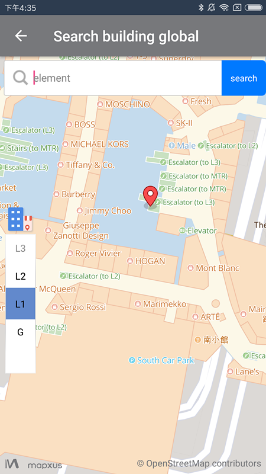

### 3.6 POI搜索
POI搜索是通过PoiSearch类提供功能，实用如下方式初始化：

**初始化 BuildingSearch对象**

```java
        poiSearch = PoiSearch.newInstance();
```
**设置搜索回调监听**

```java
        poiSearch.setPoiSearchResultListener(this);
```

#### 3.6.1 搜索附近POI

##### 3.6.1.1 设置查询参数

```java
		NearbySearchOption nearbySearchOption = new NearbySearchOption();
		nearbySearchOption.mRadius = 2;
		nearbySearchOption.location(new LatLng(
		        LatLngConstant.ELEMENT_LATLON.getLatitude(),
		        LatLngConstant.ELEMENT_LATLON.getLongitude()));
		nearbySearchOption.keyword(keyWord);

```
##### 3.6.1.2 执行搜索

```java
poiSearch.searchNearby(nearbySearchOption);

```
##### 3.6.1.3 搜索结果处理

```java
public void onGetPoiResult(PoiResult poiResult) {
        if (poiResult.status != 0) {
            Toast.makeText(this, poiResult.error.toString(), Toast.LENGTH_LONG).show();
            return;
        }
        if (poiResult.getAllPoi() == null || poiResult.getAllPoi().isEmpty()) {
            Toast.makeText(this, getString(R.string.no_result), Toast.LENGTH_LONG).show();
            return;
        }

        mapboxMap.clear();
        poiOverlay = new MyPoiOverlay(mapboxMap, poiResult.getAllPoi());
        poiOverlay.addToMap();
        poiOverlay.zoomToSpan();
    }

```
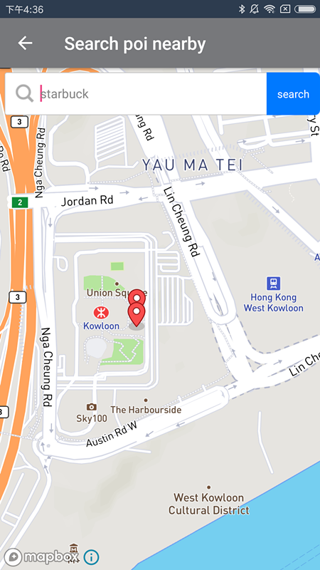

#### 3.6.2 POI的搜索范围


##### 3.6.2.1 设置查询参数

```java

BoundSearchOption boundSearchOption = new BoundSearchOption();
boundSearchOption.bound(latLngBounds);
boundSearchOption.keyword(keyWord);

```
##### 3.6.2.2 执行搜索

```java
poiSearch.searchInBound(boundSearchOption);
```
##### 3.6.2.3 搜索结果处理

```java
public void onGetPoiResult(PoiResult poiResult) {
        if (poiResult.status != 0) {
            Toast.makeText(this, poiResult.error.toString(), Toast.LENGTH_LONG).show();
            return;
        }
        if (poiResult.getAllPoi() == null || poiResult.getAllPoi().isEmpty()) {
            Toast.makeText(this, getString(R.string.no_result), Toast.LENGTH_LONG).show();
            return;
        }

        mapboxMap.clear();
        poiOverlay = new MyPoiOverlay(mapboxMap, poiResult.getAllPoi());
        poiOverlay.addToMap();
        poiOverlay.zoomToSpan();
    }

```

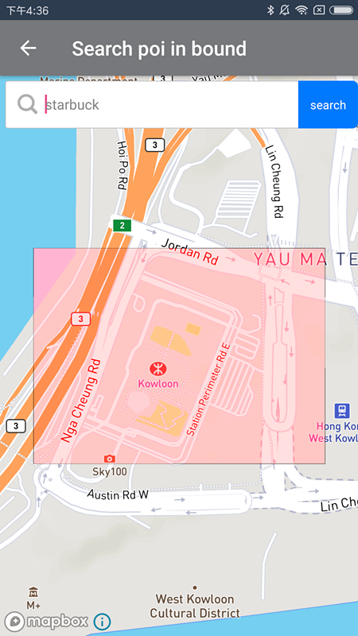

       
#### 3.6.3 根据ID搜索POI

##### 3.6.3.1 设置查询参数

```java
DetailSearchOption detailSearchOption = new DetailSearchOption();
detailSearchOption.id(keyWord);

```
##### 3.6.3.2 执行搜索

```java
poiSearch.searchPoiDetail(detailSearchOption);
```
##### 3.6.3.3 搜索结果处理

```java
public void onGetPoiDetailResult(PoiDetailResult poiDetailResult) {
        if (poiDetailResult.status != 0) {
            Toast.makeText(this, poiDetailResult.error.toString(), Toast.LENGTH_LONG).show();
            return;
        }
        if (poiDetailResult.getPoiInfo() == null) {
            Toast.makeText(this, getString(R.string.no_result), Toast.LENGTH_LONG).show();
            return;
        }

        mapboxMap.clear();
        PoiInfo poiInfo = poiDetailResult.getPoiInfo();

        Marker marker = mapboxMap.addMarker(new ObjectMarkerOptions()
                .position(
                        new LatLng(poiInfo.getLocation()
                                .getLat(), poiInfo
                                .getLocation().getLon()))
                .title(poiInfo.getName().get("default")).snippet("buildingId:" + poiInfo.getBuildingId())
                .object(poiInfo));
        mapboxMap.moveCamera(CameraUpdateFactory.newLatLngZoom(marker.getPosition(), 19));
    }

```
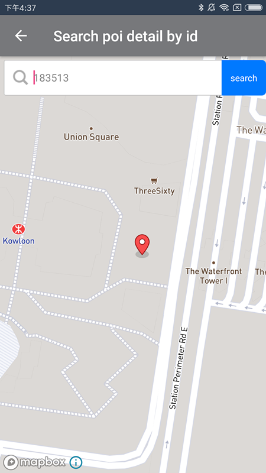
#### 3.6.4 搜索室内POI信息

##### 3.6.4.1 设置查询参数

```java
InBuildingSearchOption inBuildingSearchOption = new InBuildingSearchOption();
inBuildingSearchOption.buildingId(buildingId);
inBuildingSearchOption.keyword(keyWord);

```
##### 3.6.4.2 执行搜索

```java
poiSearch.searchInBuilding(inBuildingSearchOption);
```
##### 3.6.4.3 搜索结果处理

```java
@Override
    public void onGetPoiResult(PoiResult poiResult) {
        if (poiResult.status != 0) {
            Toast.makeText(this, poiResult.error.toString(), Toast.LENGTH_LONG).show();
            return;
        }
        if (poiResult.getAllPoi() == null || poiResult.getAllPoi().isEmpty()) {
            Toast.makeText(this, getString(R.string.no_result), Toast.LENGTH_LONG).show();
            return;
        }

        mapboxMap.clear();
        poiOverlay = new MyPoiOverlay(mapboxMap, poiResult.getAllPoi());
        poiOverlay.addToMap();
        poiOverlay.zoomToSpan();
    }

```

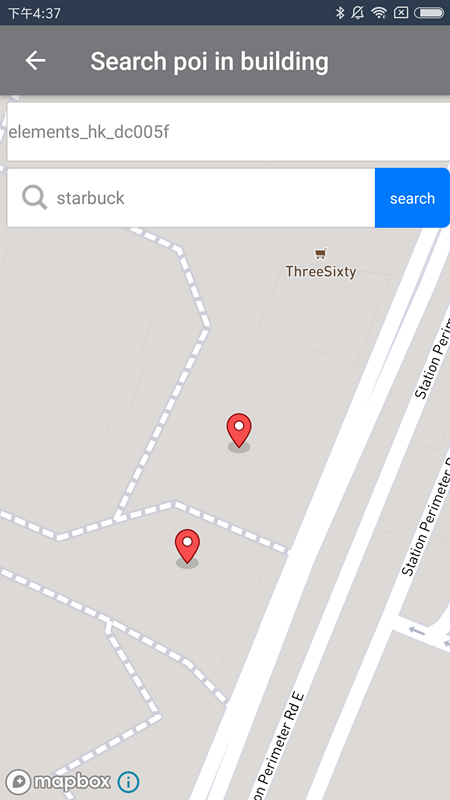

#### 3.6.5 搜索室内POI的类别

##### 3.6.5.1 设置查询参数

~~~java
PoiCategorySearchOption poiCategorySearchOption = new PoiCategorySearchOption();
poiCategorySearchOption.buildingId(buildingId);
poiCategorySearchOption.floor(floor);
~~~

##### 3.6.5.2 执行搜索

~~~java
poisearch.searchPoiCategoryInBuilding(poiCategorySearchOption);
~~~

##### 3.6.5.3 搜索结果处理
~~~java
@Override
public void onPoiCategoriesResult(PoiCategoryResult poiCategoryResult){
	poiCategoryResult.getResult();
}
~~~

### 3.7 路径查找

路线查找可以根据起终点，使用WalkRouteOverlay画出路线图层，包括起终点和转弯点。

##### 第一步,初始化RoutePlanning对象

```java
        private RoutePlanning routePlanning;
        routePlanning = RoutePlanning.newInstance();
```
##### 第二步,设置路线查询回调监听

```java
        routePlanning.setRoutePlanningListener(this);
```
##### 第三步,设置搜索参数

```java
     private RoutePlanningPoint origin = new RoutePlanningPoint("elements_hk_dc005f", "L1", 114.16130, 22.30585);
    private RoutePlanningPoint destination = new RoutePlanningPoint("elements_hk_dc005f", "L3", 114.16185, 22.30405);
```
  
##### 第四步,查询路线

```java
        routePlanning.route(origin, destination);
```
##### 第五步,查询回调

```java
   @Override
    public void onGetRoutePlanningResult(RoutePlanningResult routePlanningResult) {
        if (routePlanningResult.status != 0) {
            Toast.makeText(this, routePlanningResult.error.toString(), Toast.LENGTH_LONG).show();
            return;
        }
        if (routePlanningResult.getRouteResponseDto() == null) {
            Toast.makeText(this, getString(R.string.no_result), Toast.LENGTH_LONG).show();
            return;
        }
        RouteResponseDto routeResponseDto = routePlanningResult.getRouteResponseDto();
        drawRoute(routeResponseDto);
        mMapxusMap.switchFloor(origin.getFloor());
    }
```
##### 第六步,绘制路线

```java
    private void drawRoute(RouteResponseDto route) {
        // Convert LineString coordinates into LatLng[]

        WalkRouteOverlay walkRouteOverlay = new WalkRouteOverlay(this, mapboxMap, mMapxusMap, route, origin, destination);
        walkRouteOverlay.addToMap();
    }
```
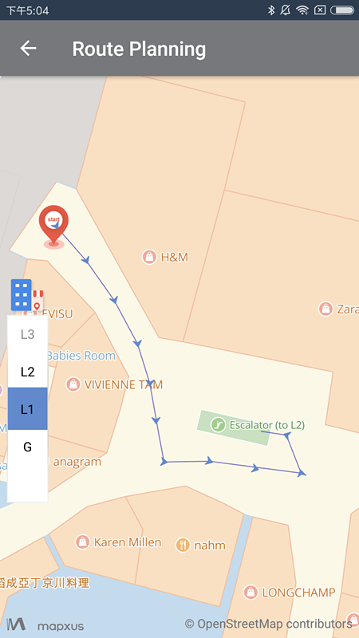

### 3.8 自定义地图样式

自定义地图样式，通过改变底图各元素和文字的颜色、可见性，实现地图多样展现效果，适配各个行业不同的地图呈现效果或适配不同App风格:
目前提供4种风格设置，分别是: Style.COMMON,Style.MAPPYBEE,Style.HALLOWEEN,Style.CHRISTMAS,Style.COMMON
可以根据如下接口设置style:

```java
mapViewProvider.setStyle(Style.COMMON);
```
      
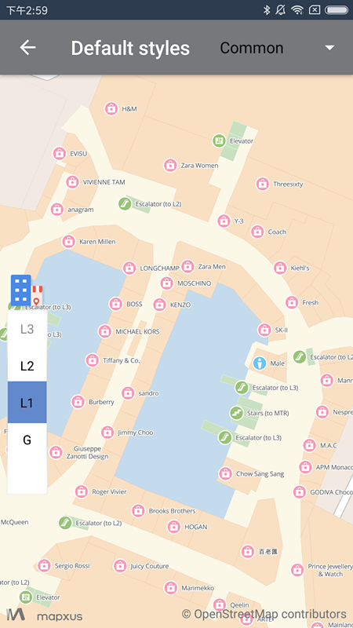


